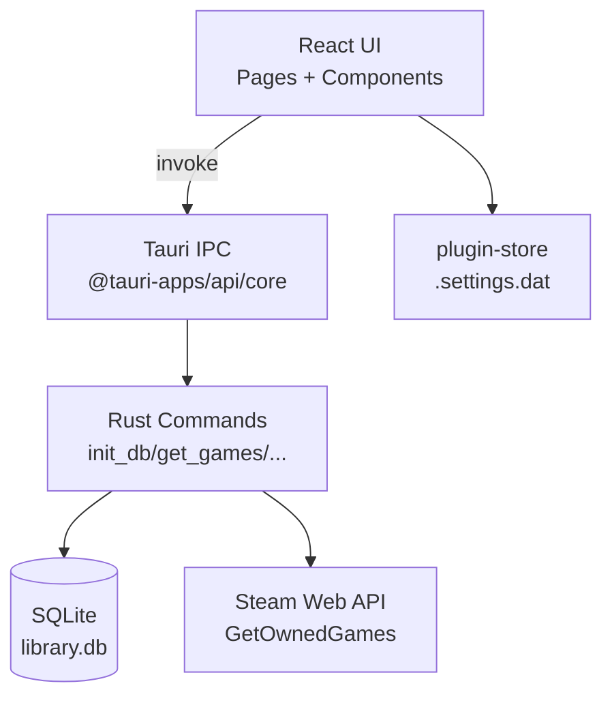

# Arquitetura Técnica — Game Manager

Este documento descreve a arquitetura do **Game Manager**, um aplicativo desktop **local-first** para gerenciamento de biblioteca de jogos, construído com **Tauri (Rust)** no backend nativo e **React (TypeScript)** no frontend.

## Visão Geral

**Objetivo do produto:** centralizar uma biblioteca de jogos com operações de CRUD, favoritos, estatísticas básicas e importação da Steam.

**Princípios arquiteturais do projeto:**

- **Local-first / offline-first**: dados persistidos localmente em SQLite; a aplicação funciona offline (exceto integrações externas como Steam).
- **Separação de responsabilidades**: UI/UX no frontend, persistência e integrações nativas no backend Rust.
- **Interface bem definida**: comunicação via *Tauri Commands* (IPC) usando `invoke`.
- **Type safety ponta a ponta**: tipos TypeScript no frontend e structs Rust serializáveis no backend.

## Stack Tecnológica

### Frontend

- React 19 + TypeScript
- Vite (dev server/build)
- Tailwind CSS v4 + shadcn/ui (Radix primitives)

### Desktop/Backend

- Tauri v2
- Rust 2021
- SQLite via `rusqlite` (DB embarcado)
- HTTP client: `reqwest` (integração Steam)
- Persistência de settings: `tauri-plugin-store`
- Abertura de links: `tauri-plugin-opener`

## Arquitetura de Alto Nível

O app é essencialmente um **frontend SPA** dentro de uma *WebView* + um **host nativo** (Tauri) que expõe comandos.

### Organização do repositório

- `src/`: frontend React/TypeScript
- `src-tauri/`: backend Rust/Tauri e configuração desktop
- `docs/`: documentação técnica

## Frontend (React/Vite)

### Estrutura principal

- `src/main.tsx`: bootstrap do React
- `src/App.tsx`: root component e **estado global local** (lista de jogos, seção ativa, busca, modal)
- `src/pages/`: páginas (Home, Library, Favorites, Settings)
- `src/components/`: componentes de layout e domínio (GameCard, GameGrid, AddGameModal)
- `src/components/ui/`: componentes base (shadcn/ui + Radix)
- `src/types.ts`: contrato principal `Game` (espelha `models::Game` no Rust)

### Navegação e composição

A navegação é controlada por estado local (`activeSection`) no `App.tsx` e renderiza páginas via `switch`.

As páginas `Library` e `Favorites` filtram localmente (via `useMemo`) usando `searchTerm`.

### Estado e fluxo de dados (UI)

O `App.tsx` é o *state root*:

- Mantém a lista `games` em memória
- Busca do backend via `refreshGames()`
- Encapsula ações CRUD e repassa para `GameGrid/GameCard`

### Startup do frontend

1. `App.tsx` executa `invoke("init_db")` no mount.
2. Em seguida chama `refreshGames()` → `invoke("get_games")`.
3. Renderiza as páginas conforme `activeSection`.

### UI/Theming

O tema é controlado via classe `dark` no `document.documentElement` (ver `src/components/Header.tsx`) e tokens CSS em `src/index.css`.

## Backend (Tauri/Rust)

### Entrypoint e setup

- `src-tauri/src/main.rs`: chama `game_manager_lib::run()`
- `src-tauri/src/lib.rs`: configura plugins, abre o SQLite e registra comandos

O backend mantém um `AppState` com `Mutex<rusqlite::Connection>`.

**Local do banco:** o arquivo `library.db` fica em `app_data_dir` (diretório de dados da aplicação fornecido pelo Tauri) — isso garante persistência por usuário e evita gravar dentro da pasta do projeto.

### Módulos Rust

- `src-tauri/src/models.rs`: structs serializáveis (ex.: `Game`)
- `src-tauri/src/steam_service.rs`: integração com Steam Web API

### Comandos (IPC)

Os comandos expostos via `invoke_handler` são:

- `init_db`: cria tabela `games`, índices e ativa WAL
- `get_games`: lista todos os jogos
- `add_game`: insere um jogo (com validações)
- `update_game`: atualiza um jogo (com validações)
- `delete_game`: remove por `id`
- `toggle_favorite`: inverte o campo `favorite`
- `import_steam_library`: busca jogos da Steam e faz *upsert* simplificado (`INSERT OR IGNORE`)

> Observação importante (contrato de parâmetros): os comandos em Rust usam nomes `snake_case` (ex.: `steam_id`, `api_key`, `cover_url`). No frontend, é comum enviar as chaves em `camelCase` (ex.: `steamId`, `apiKey`, `coverUrl`) — e o Tauri faz o mapeamento para os parâmetros Rust.

## Persistência (SQLite)

### Tabela `games`

A tabela é criada/garantida em `init_db`:

- `id` (TEXT, PK)
- `name` (TEXT, NOT NULL)
- `genre` (TEXT, opcional)
- `platform` (TEXT, opcional)
- `cover_url` (TEXT, opcional)
- `playtime` (INTEGER, default 0)
- `rating` (INTEGER, opcional)
- `favorite` (BOOLEAN, default FALSE)

### Índices e WAL

O backend cria índices para:

- `favorite`
- `name` (case-insensitive)
- `platform`

E ativa `PRAGMA journal_mode=WAL` para melhorar concorrência em leitura/escrita.

### Estratégia de concorrência

O `rusqlite::Connection` é protegido por `Mutex`. Isso simplifica o modelo (uma conexão serializada) e evita corrupção, mas significa que operações longas podem bloquear outras chamadas enquanto o lock estiver mantido.

## Integração Steam

### Fluxo

1. O usuário informa `steamId` (64-bit) e `apiKey` na página Settings.
2. As credenciais são salvas localmente via `tauri-plugin-store` em `.settings.dat`.
3. A UI chama `invoke("import_steam_library", ...)`.
4. O backend usa `steam_service::list_steam_games` para chamar `GetOwnedGames`.
5. Para cada jogo retornado, tenta inserir em `games` com `INSERT OR IGNORE`.
6. Retorna uma mensagem com a contagem de novos jogos importados.

### Normalização de dados Steam

- O `id` do jogo importado é o `appid` (convertido para string)
- `genre` é preenchido como `"Desconhecido"` (a chamada atual não traz gênero)
- `platform` é `"Steam"`
- `cover_url` usa o padrão de CDN: `steam/apps/{appid}/library_600x900.jpg`
- `playtime` vem em minutos e é convertido para horas (arredondado)

## Segurança e Permissões

### Tauri capabilities

As permissões ficam em `src-tauri/capabilities/default.json` e incluem:

- `core:default`
- `opener:*` (abrir links)
- `store:*` (get/set/save)

### CSP

No `src-tauri/tauri.conf.json`, a CSP está configurada como `null`. Isso facilita desenvolvimento, mas é um ponto de atenção para releases (reduz proteção contra injeções via WebView).

### Dados sensíveis

As credenciais Steam são persistidas localmente usando `tauri-plugin-store`.

## Build, Dev e Empacotamento

### Dev

O fluxo padrão é:

1. `npm install`
2. `npm run tauri dev`

O Tauri roda o Vite dev server na porta `1420` (configurado em `vite.config.ts` e `src-tauri/tauri.conf.json`).

### Build

O build desktop executa:

- `npm run build` (TypeScript + Vite build)
- Tauri empacota e aponta `frontendDist` para `dist/`

## Extensibilidade

### Recomendações

O projeto já possui documentação e intenção de um sistema de recomendação. Sugestão de acoplamento arquitetural (mantendo o princípio local-first):

- **Frontend**: exibir recomendações como uma seção/página e permitir feedback do usuário (ex.: “gostei/não gostei”).
- **Backend**: calcular recomendações offline com base nos dados da tabela `games` e armazenar resultados em uma tabela própria (ou recalcular sob demanda).

Veja: `docs/recommendation-system.md`.

### Novas integrações (Epic/GOG/Xbox)

O padrão usado pela Steam (Settings → invoke → service → insert no SQLite) pode ser reaproveitado criando novos módulos `*_service.rs` e novos comandos.

---

*Documentação mantida por: Alan de Oliveira Gonçalves*  
*Última atualização: Dezembro/2025*  
*Versão: 1.0*
